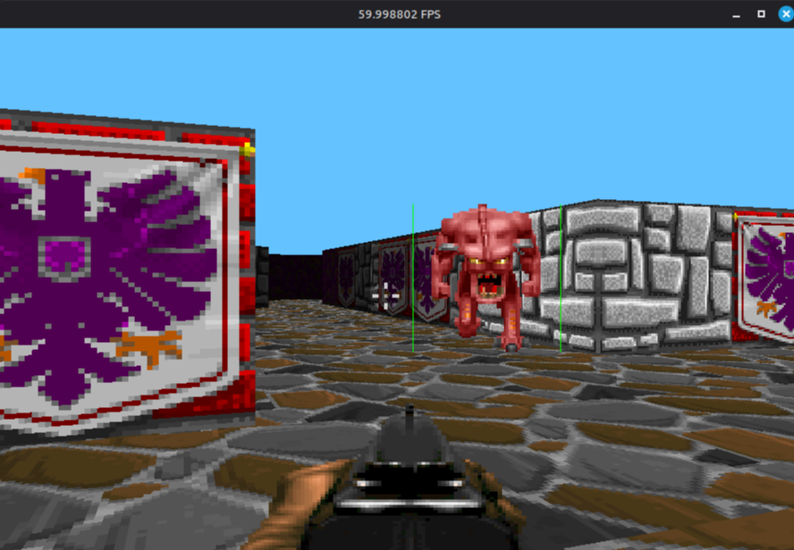

# 3D Raycaster Game with AI Bots (C++/SFML)

 <!-- Замените на свой скриншот -->

Проект представляет собой классический 3D-шутер от первого лица, полностью написанный на C++ с использованием библиотеки SFML для графики и ввода. Ядро рендеринга построено на алгоритме **raycasting**, что позволяет имитировать трехмерную графику, выполняя все вычисления на **CPU**. В игре реализованы интеллектуальные противники (**боты**), которые перемещаются по карте, используя алгоритм поиска пути **A*** (A-star).

## 🎮 Особенности

*   **Кастомный 3D Raycaster:** Полноценный 3D-рендеринг "изнутри" (Wolfenstein 3D стиль) без использования OpenGL/DirectX. Все расчеты лучей, текстур и освещения выполняются на CPU.
*   **Искусственный интеллект:** Боты анализируют карту и находят оптимальный путь к игроку с помощью алгоритма **A***.
*   **Технологический стек:**
    *   Язык: **C++17**
    *   Графика, окно, ввод, звук: **SFML 2.5+**
    *   Алгоритмы: Raycasting, A* Pathfinding
*   **Игровой процесс:** Стрельба, поиск выхода, противостояние ботам.
*   **Редактируемые карты:** Уровни задаются простыми текстовыми файлами или двумерными массивами.

## 📸 Скриншоты

## 🛠 Сборка и запуск

### Предварительные требования
*   Компилятор C++ с поддержкой C++17 (GCC, Clang, MSVC)
*   Установленная библиотека **SFML** (версия 2.5.x или выше)
*   CMake (рекомендуется) или умение настроить проект в вашей IDE

### Инструкция (через CMake)
```bash
# 1. Клонируйте репозиторий
git clone https://github.com/your_username/raycaster-game.git
cd raycaster-game

# 2. Создайте директорию для сборки и сгенерируйте проект
mkdir build && cd build
cmake ..

# 3. Соберите проект
# Для Linux/macOS:
make
# Для Windows (MSVC):
cmake --build . --config Release

# 4. Запустите исполняемый файл
./RaycasterGame   # или RaycasterGame.exe на Windows
```

### Настройка вручную (например, в Visual Studio)
1.  Создайте новый пустой проект C++.
2.  Добавьте все `.cpp` и `.hpp` файлы из исходного кода.
3.  Настройте проект для работы с SFML: укажите пути к заголовочным файлам (`include`) и библиотекам (`lib`), а также скопируйте DLL файлы SFML рядом с исполняемым файлом.
4.  Скомпилируйте и запустите.

## 🧠 Архитектура и ключевые компоненты

*   `Game.cpp/hpp` – главный цикл игры, управление состоянием.
*   `Raycaster.cpp/hpp` – ядро рендеринга. Содержит функции для испускания лучей, расчета высоты стен, наложения текстур и отрисовки пола/потолка.
*   `World.cpp/hpp` – представление игрового мира (карта, игрок, боты, коллизии).
*   `BotAI.cpp/hpp` – реализация логики ботов, включая алгоритм A* для поиска пути и конечный автомат (FSM) для поведения (патрулирование, преследование, атака).
*   `Player.cpp/hpp` – управление состоянием игрока (перемещение, здоровье, оружие).
*   `Utils.cpp/hpp` – вспомогательные функции (загрузка текстур, работа с векторами и т.д.).

### Алгоритмы в деталях
1.  **Raycasting:** Для каждого вертикального столбца экрана испускается луч. Определяется расстояние до ближайшей стены, которое преобразуется в высоту отрисовываемого столбца. Наложение текстур производится с учетом координаты попадания луча в стену.
2.  **A* Pathfinding:** Бот преобразует непрерывные координаты в узлы сетки. Алгоритм оценивает стоимость пути до цели (`gCost`), эвристику (`hCost`) и их сумму (`fCost`). Открытый и закрытый списки управляют исследованием узлов, пока не будет найден оптимальный путь.

## 📂 Структура проекта
```
.
├── src/                 # Исходный код
│   ├── Game.cpp/hpp
│   ├── Raycaster.cpp/hpp
│   ├── World.cpp/hpp
│   ├── BotAI.cpp/hpp
│   ├── Player.cpp/hpp
│   └── ...
├── assets/              # Ресурсы
│   ├── textures/        # Текстуры стен, спрайтов, HUD
│   ├── sounds/          # Звуки и музыка
│   └── maps/            # Файлы карт (.txt или .map)
├── screenshots/         # Скриншоты для README
├── CMakeLists.txt       # Файл конфигурации CMake
└── README.md            # Этот файл
```

## 📄 Лицензия
Этот проект распространяется под лицензией MIT. Подробнее см. в файле `LICENSE`.
